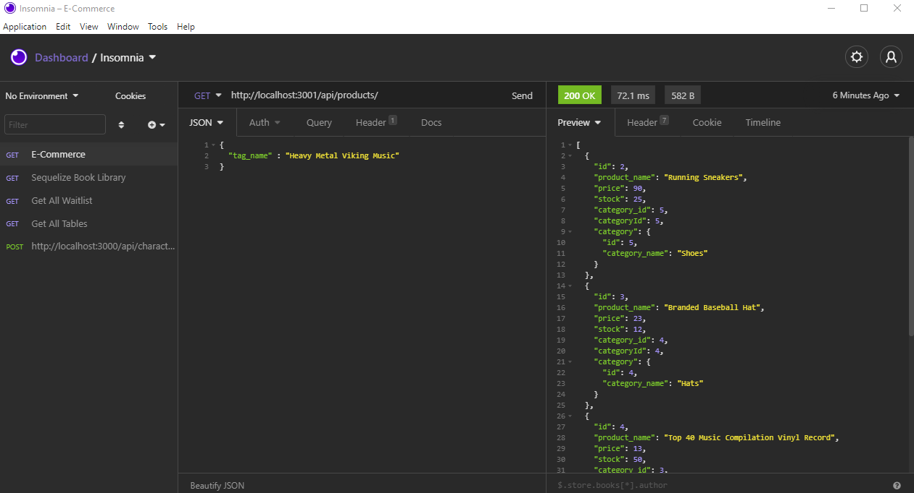

# E-COMMERCE-BACKEND

## DESCRIPTION
This app was created for the UW Full-Stack Web-Development Bootcamp. It is the back end of an e-commerce site that stores products, categories, and tags.  You can access the different products, categories, tags and their associations by querying them through the api.

## WALKTHROUGH VIDEO LINK
Part 1: https://drive.google.com/file/d/1MAB1fmnEiKb7rLgCqZ9Jl5opzpZpiVKJ/view
Part 2: https://drive.google.com/file/d/1yCqLucX9BQ0EBaFWFJvw3kQ4TOzMmmFo/view

## SCREENSHOT
